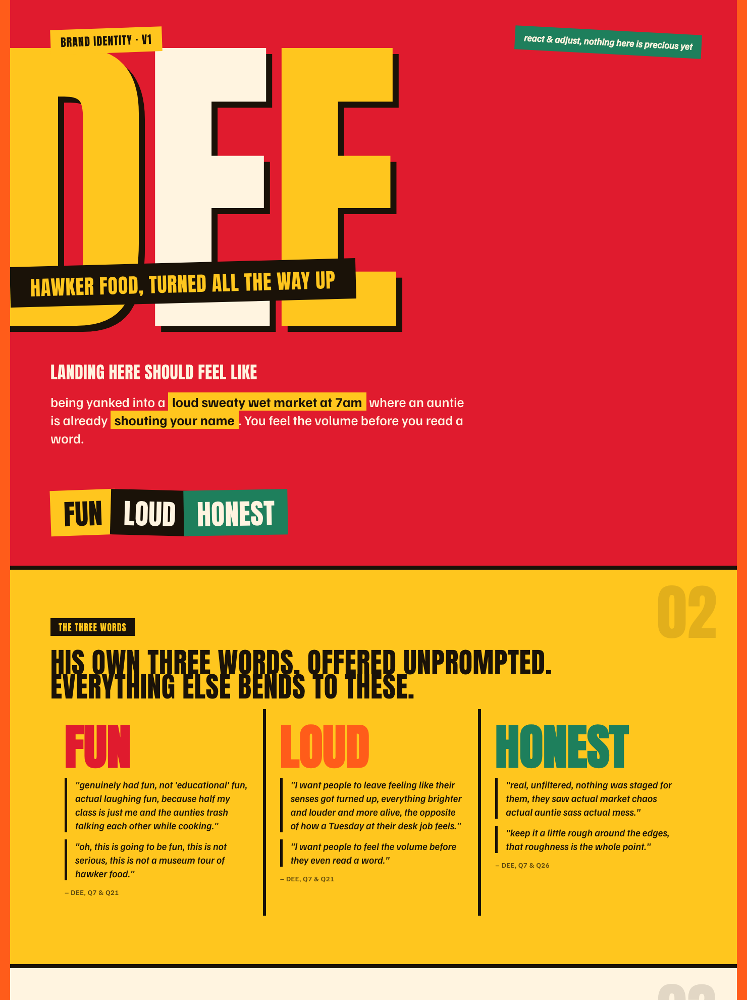

# Design with feel and taste

A small kit that finds your design taste in the way you talk, then applies it to reels, carousels, and any creative work. Every choice traced to something you actually said. No moodboards, no guessing.

Rules can stop an AI from designing like an AI. Your own words are what make it design like you.

## Quickstart

Two ways in, same result.

**Talk to your phone.** Answer the eight questions in [QUESTIONS.md](QUESTIONS.md) by voice memo, transcribe, paste the transcripts under the prompt in [DERIVE_PROMPT.md](DERIVE_PROMPT.md), give it to a capable AI. Voice is the richest input; rambling is the point.

**Or talk to the AI.** Paste [INTERVIEW_PROMPT.md](INTERVIEW_PROMPT.md) together with [DERIVE_PROMPT.md](DERIVE_PROMPT.md) into a capable AI and say "start". It interviews you in chat, one question at a time, some multiple choice, most open-ended, and it won't touch design until it has asked enough.

Either way you get back a visual direction: palette with named harmony, type pairing, layout grammar, a voice contract, your own banned list. Every pick cites your words. Then turn it into actual work with [APPLYING_IT.md](APPLYING_IT.md): reels, carousels, posts, anything.

## Install it as an agent skill

The whole method also ships as one portable [Agent Skill](https://github.com/vercel-labs/agent-skills) for Claude Code, Codex, Cursor, and anything else that reads SKILL.md:

```bash
npx skills add https://github.com/Aexagon/design-with-feel-and-taste
```

The install name is `design-from-voice`. Once installed, the agent runs the interview, holds the coverage gate, derives the direction with citations, and applies the exit checks on its own. The copy-paste prompts above stay the way in for plain chat.

## Why trust it

The method was tested on a client who cannot be googled, because he does not exist. One agent invented "Dee", a Singapore hawker-food creator, wrote his messy interview transcripts, and sealed an answer key stating what his brand should feel like. A second agent, blind to the key, derived his direction from the transcripts alone. It scored five for five: tone words verbatim, palette temperature exact, type energy exact, every forbidden direction caught, same feeling in one sentence, independently reached.

The whole run is in [example/](example/): transcripts, sealed key, scoring, and the loud orange identity it produced. Read it to see what good input and good output look like.



Every element in that image cites a line Dee said. The red is the market at 7am, the three words are his own, offered unprompted.

## Files

| File | What it is |
|---|---|
| [QUESTIONS.md](QUESTIONS.md) | Start here. Eight questions plus three sliders, built for rambling |
| [INTERVIEW_PROMPT.md](INTERVIEW_PROMPT.md) | No memos? The AI interviews you in chat instead |
| [DERIVE_PROMPT.md](DERIVE_PROMPT.md) | The copy-paste prompt that turns transcripts into a direction |
| [APPLYING_IT.md](APPLYING_IT.md) | Direction to reels, carousels, and everything else |
| [skills/design-from-voice/](skills/design-from-voice/SKILL.md) | The whole method as one installable Agent Skill |
| [example/](example/) | One full test run, end to end, receipts included |

## The principle

Design with reasons. A colour you can defend with a quote beats a colour you like. If a choice can't state its reason, change the choice.

---

A working method, kept small on purpose. What changes and why lives in the [CHANGELOG](CHANGELOG.md). Built by [Aexagon](https://aexagon.com). MIT licensed, take it and run.
